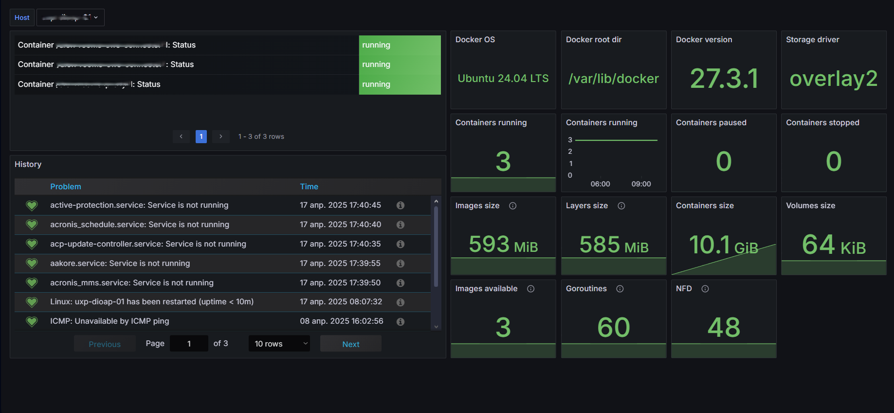

# Grafana Dashboard for Docker Monitoring via Zabbix

[](https://grafana.com) 
[](https://www.zabbix.com) 
[](https://www.docker.com)

This dashboard provides comprehensive monitoring for Docker containers using Zabbix as the data source. It displays key container metrics, statuses, and resource utilization.

<!-- TOC tocDepth:2..3 chapterDepth:2..6 -->
- [Grafana Dashboard for Docker Monitoring via Zabbix](#grafana-dashboard-for-docker-monitoring-via-zabbix)
  - [🖥️ Interface Screenshots](#️-interface-screenshots)
  - [📊 Key Features](#-key-features)
  - [🧩 Dashboard Components](#-dashboard-components)
  - [⚙️ System Requirements](#️-system-requirements)
  - [🚀 Installation](#-installation)
  - [🔧 Zabbix Configuration](#-zabbix-configuration)
  - [⚠️ Implementation Notes](#️-implementation-notes)
    - [Threshold Values](#threshold-values)
  - [📄 License](#-license)
<!-- /TOC -->

## 🖥️ Interface Screenshots



## 📊 Key Features

- Real-time container status monitoring (running/paused/stopped)
- Docker daemon information (version, OS, storage driver)
- Resource usage metrics (CPU, memory, storage)
- Container size and image/layer metrics
- Goroutines and file descriptors monitoring
- Historical data and alerts visualization

## 🧩 Dashboard Components  

1. **Container Status Table** - Overview of all containers with their current status
2. **Docker Info Panels** - Version, OS, root directory, and storage driver
3. **Container Count Metrics** - Running/paused/stopped containers with trends
4. **Storage Metrics** - Images, layers, containers and volumes size
5. **System Metrics** - Goroutines count and file descriptors usage
6. **History Panel** - Historical events and triggers


## ⚙️ System Requirements

1. **Zabbix Server** 6.0+
2. **Grafana** 11.0+
3. **Zabbix plugin for Grafana** (alexanderzobnin-zabbix-app)

## 🚀 Installation
1. Install Zabbix plugin for Grafana following the [vendor instructions](https://grafana.com/docs/plugins/alexanderzobnin-zabbix-app/latest/installation/)
2. Configure datasource in Grafana:
   ```
   Тип: zabbix1-datasource
   URL: https://your_zabbix_server/api_jsonrpc.php
   ```
1. Import the dashboard:
   ```
   In Grafana: `Create → Import → Upload JSON file`
   Select `DockerContainers.json` file
   ```

## 🔧 Zabbix Configuration

Required items from `Docker by Zabbix Agent` template:
```plaintext
Docker by Zabbix Agent
* Container [name]: Status
* Docker: Operating system
* Docker: Docker root dir  
* Docker: Server version
* Docker: Storage driver
* Docker: Containers running/paused/stopped
* Docker: Images size/layers size
* Docker: Containers size
* Docker: Volumes size
* Docker: Images available
* Docker: Goroutines
* Docker: Nfd (Number of used File Descriptors)
```

## ⚠️ Implementation Notes

* Hosts should be in the `Containers` group in Zabbix
* The dashboard uses `$Host` variable - ensure your hosts match this pattern
* Adjust thresholds according to your environment needs
* Most metrics use `lastNotNull` reducer function

### Threshold Values

Metric | Green | Yellow | Red
-------|-------|--------|----
Container Status | Running (0) | Paused (1) | Stopped (2)
Containers Running | <80% of limit | 80-90% | >90%
Goroutines | <1000 | 1000-5000 | >5000
File Descriptors | <80% of limit | 80-90% | >90%
Storage Utilization | <80% | 80-90% | >90%
Image Size | <10GB | 10-20GB | >20GB

## 📄 License

Project is distributed under [MIT](./LICENSE.txt) license