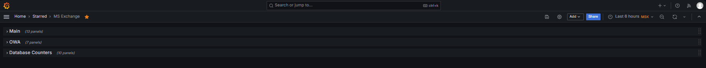
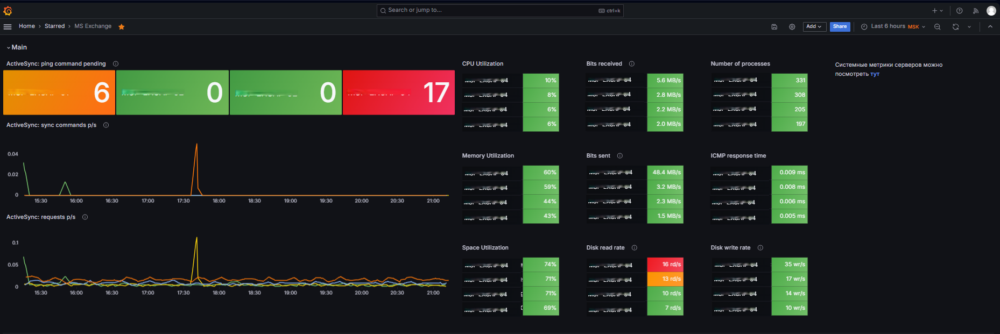
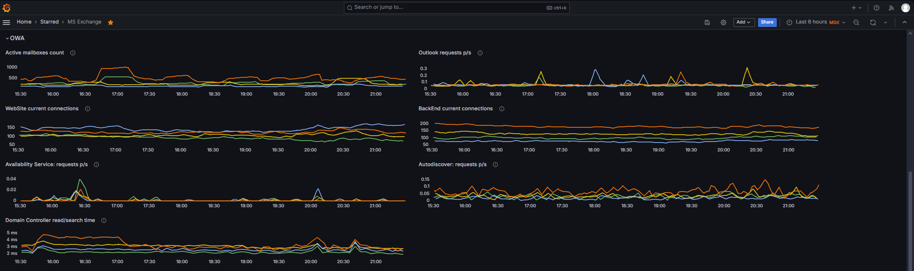
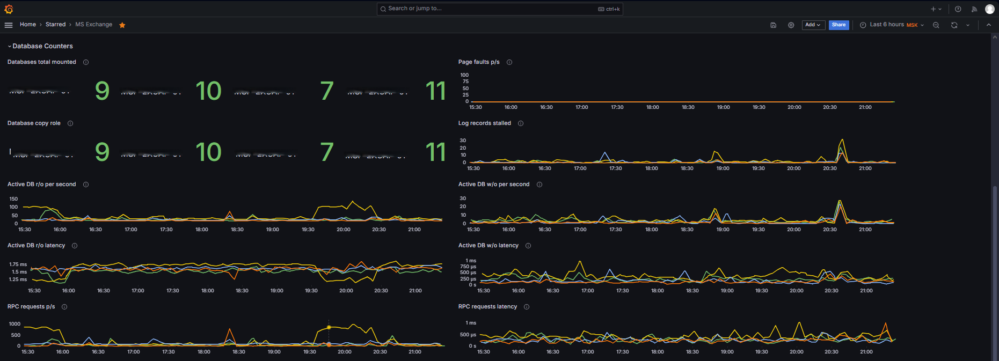

# Grafana Dashboard for Microsoft Exchange Monitoring via Zabbix

[](https://grafana.com) [](https://www.zabbix.com) [](https://www.microsoft.com/en-us/microsoft-365/exchange/email)

This dashboard provides comprehensive monitoring for Microsoft Exchange servers through Zabbix metrics, covering system resources, Exchange services, and database performance.

<!-- TOC tocDepth:2..3 chapterDepth:2..6 -->
- [Grafana Dashboard for Microsoft Exchange Monitoring via Zabbix](#grafana-dashboard-for-microsoft-exchange-monitoring-via-zabbix)
  - [🖥️ Interface Screenshots](#️-interface-screenshots)
  - [📊 Key Features](#-key-features)
  - [🧩 Dashboard Components](#-dashboard-components)
    - [Main Section](#main-section)
    - [OWA Section](#owa-section)
    - [Database Counters Section](#database-counters-section)
  - [⚙️ System Requirements](#️-system-requirements)
  - [🚀 Installation](#-installation)
  - [🔧 Zabbix Configuration](#-zabbix-configuration)
  - [⚠️ Implementation Notes](#️-implementation-notes)
    - [Hostname Macros Pattern Configuration](#hostname-macros-pattern-configuration)
    - [Threshold Values](#threshold-values)
  - [📄 License](#-license)
<!-- /TOC -->

## 🖥️ Interface Screenshots







## 📊 Key Features

- Real-time monitoring of Exchange server health
- System resource utilization (CPU, memory, disk, network)
- Exchange service metrics (ActiveSync, OWA, Autodiscover)
- Database performance counters
- Threshold-based alerting visualization
- Collapsible sections for better organization

## 🧩 Dashboard Components  

### Main Section  

- **System Metrics**:
  - Space utilization
  - Memory utilization
  - CPU utilization
  - ICMP response time
  - Number of processes
  - Disk read/write rates
  - Network traffic (bits received/sent)

- **ActiveSync**:
  - Ping command pending
  - Requests per second
  - Sync commands per second

### OWA Section
- **Mailbox Statistics**:
  - Active mailboxes count
  - Outlook Web App requests
  - Web connections (frontend/backend)
  
- **Services**:
  - Availability Service requests
  - Autodiscover requests
  - Domain Controller response times

### Database Counters Section
- **Database Health**:
  - Databases mounted
  - Database copy roles
  - Page faults
  - Log records stalled
  
- **Performance**:
  - Active database operations (read/write)
  - Operation latencies
  - RPC requests and latency


## ⚙️ System Requirements

1. **Zabbix Server** 6.0+
2. **Grafana** 11.0+
3. **Zabbix plugin for Grafana** (alexanderzobnin-zabbix-app)

## 🚀 Installation
1. Install Zabbix plugin for Grafana following the [vendor instructions](https://grafana.com/docs/plugins/alexanderzobnin-zabbix-app/latest/installation/)
2. Configure datasource in Grafana:
   ```
   Тип: zabbix1-datasource
   URL: https://your_zabbix_server/api_jsonrpc.php
   ```
1. Import the dashboard:
   ```
   In Grafana: `Create → Import → Upload JSON file`
   Select `Exchange.json` file
   ```

## 🔧 Zabbix Configuration

Required items from `MS Exchange by Zabbix Agent`, `Windows by Zabbix Agent`, `ICMP Ping` templates:
```plaintext
ICMP Ping
* ICMP response time (ms) 

Windows by Zabbix Agent
* Space utilization (%)
* Memory utilization (%)
* CPU utilization (%)
* Number of processes
* Bits received/sent (Bps)
* Disk read/write rate
* Memory page faults per second
* Free swap space in % 

MS Exchange by Zabbix Agent:
* Active mailboxes count
* ActiveSync metrics (ping, requests, sync)
* OWA requests
* Web Service connections
* Availability Service requests
* Autodiscover requests
* Database counters (mounted, roles, operations)
* RPC metrics
* Information Store metrics
* Domain Controller response times
```

## ⚠️ Implementation Notes

* Hosts should be in the `Exchange VMs` group in Zabbix
* Adjust thresholds according to your Exchange environment needs
* The dashboard uses `lastNotNull` reducer for most metrics
* Ensure Zabbix agent is properly configured to collect all required Exchange performance counters
* For accurate monitoring, proper permissions must be configured for Zabbix to access Exchange metrics
* The dashboard monitors key Exchange components: `Client Access`, `Mailbox`, `Transport services`

### Hostname Macros Pattern Configuration
The dashboard uses regex patterns to extract and format hostnames. Here are the key patterns and how to customize them:

**General Hostname Pattern**:
```regex
/^([^:]+):.*$/
```
Extracts just the hostname part before the first colon

To customize:
* Replace "MSP-MSQDB" with your hostname prefix
* Adjust the AG and replica patterns if your naming differs

**Component-Specific Patterns**:
```regex
/: (Windows|Space|ICMP|Disk|Bits|MS Exchange).*$/
```
Removes Windows performance counter prefixes and component identifiers

**ActiveSync Pattern**:
```regex
/^([^:]+): MS Exchange.*$/
```
Extracts hostname from Exchange-specific metrics

To modify these patterns:
* Identify your Exchange server naming convention
* Update the regex to match your pattern
* Test with sample item names from your Zabbix
* Adjust the replacement pattern ($1, $2, etc.) to format as desired

For example, if your Exchange servers are named "EXCH-01", change:
```regex
/^([^:]+):/ → /^EXCH-(\d+):/
```

### Threshold Values

Metric | Green | Yellow | Red
-------|-------|--------|----
CPU Utilization (%) | <50 | 50-90 | >90
Memory Utilization (%) | <80 | 80-90 | >90
Space Utilization (%) | <80 | 80-90 | >90
ICMP Response Time (ms) | <0.18 | 0.18-0.3 | >0.3
Number of Processes | <500 | 500-700 | >700
Disk Read Rate (ops/s) | <50 | 50-100 | >100
Disk Write Rate (ops/s) | <50 | 50-200 | >200
Network Traffic (Bps) | <50M | 50M-200M | >200M
ActiveSync Pending Commands | 0 | 1-5 | >5
OWA Requests (per sec) | - | - | -
Current Connections | - | - | -
Database Copy Role | 1 (Active) | 2 (Passive) | 3 (Lagged)
Page Faults (per sec) | - | - | -
Log Records Stalled | <50 | 50-70 | >70
Active DB Read Ops (per sec) | <500 | 500-1000 | >1000
Active DB Write Ops (per sec) | <500 | 500-1000 | >1000
DB Read Latency (ms) | <10 | 10-20 | >20
DB Write Latency (ms) | <10 | 10-20 | >20
RPC Requests (per sec) | <350 | 350-500 | >500
RPC Latency (ms) | <20 | 20-40 | >40

## 📄 License

Project is distributed under [MIT](./LICENSE.txt) license