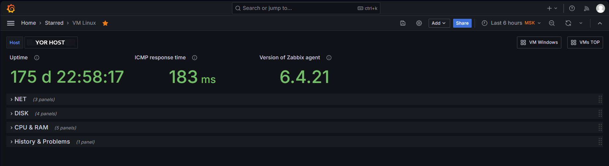
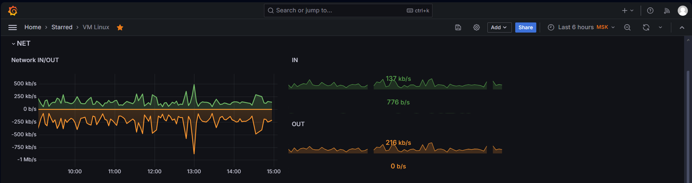
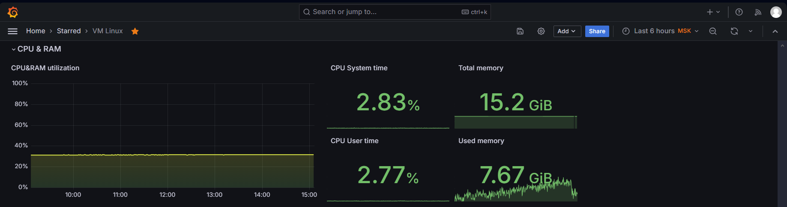
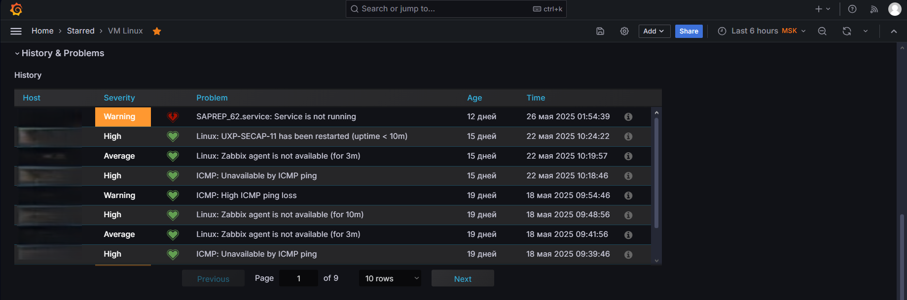
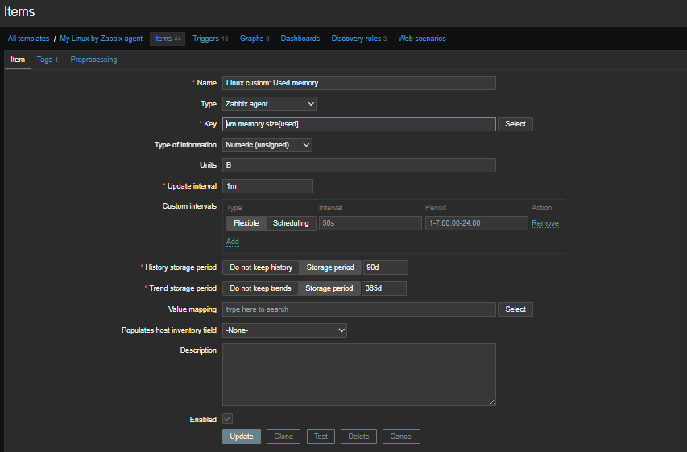
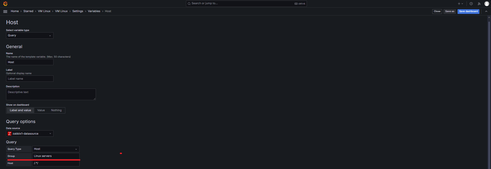

# Grafana Dashboard for Linux Server Monitoring via Zabbix

[](https://grafana.com) [](https://www.zabbix.com) [](https://www.linux.com/) 

A dashboard for visualizing Linux server metrics collected via Zabbix agent.

<!-- TOC tocDepth:2..3 chapterDepth:2..6 -->
- [Grafana Dashboard for Linux Server Monitoring via Zabbix](#grafana-dashboard-for-linux-server-monitoring-via-zabbix)
  - [🖥️ Interface Screenshots](#️-interface-screenshots)
  - [📊 Key Features](#-key-features)
  - [🧩 Dashboard Components](#-dashboard-components)
    - [Core Metrics](#core-metrics)
    - [Dashboard Sections](#dashboard-sections)
  - [⚙️ System Requirements](#️-system-requirements)
  - [🚀 Installation](#-installation)
  - [🔧 Zabbix Configuration](#-zabbix-configuration)
  - [⚠️ Implementation Notes](#️-implementation-notes)
  - [📄 License](#-license)
<!-- /TOC -->

## 🖥️ Interface Screenshots







## 📊 Key Features

* Real-time system metrics monitoring
* Resource utilization visualization: CPU, RAM, disks, network
* Problem history and event tracking
* Automatic discovery of network interfaces and filesystems
* Integration with Zabbix triggers and alerts

## 🧩 Dashboard Components

### Core Metrics

* System uptime
* Zabbix agent version
* ICMP response time

### Dashboard Sections

**NET** - Network Interfaces
* IN/OUT traffic graphs
* Incoming/outgoing traffic statistics

**DISC** - Disk Systems
* Space utilization (%)
* Total disk capacity
* Read/write speeds

**CPU&RAM** - Processor and Memory
* CPU and RAM load graphs
* CPU time breakdown (system/user)
* Total and used memory

**History & Problems** - Problem History
* Event timeline
* Severity sorting (Warning, Average, High)
* Time-based filtering

## ⚙️ System Requirements

1. **Zabbix Server** (version 6.0+)
2. **Grafana** (version 11.0+)
3. **Grafana Zabbix Plugin** ([alexanderzobnin-zabbix-app](https://grafana.com/grafana/plugins/alexanderzobnin-zabbix-app/))
4. Linux servers with:
   - Zabbix Agent 2
   - Metrics collected via `Linux by Zabbix Agent` template


## 🚀 Installation
1. Install Zabbix plugin for Grafana following the [vendor instructions](https://grafana.com/docs/plugins/alexanderzobnin-zabbix-app/latest/installation/)
2. Configure datasource in Grafana:
   ```
   Тип: zabbix1-datasource
   URL: https://your_zabbix_server/api_jsonrpc.php
   ```
1. Import the dashboard:
   ```
   In Grafana: `Create → Import → Upload JSON file`
   Select `Linux_Basic_Metrics.json` file
   ```

## 🔧 Zabbix Configuration
Add the following item to your template: `Linux custom: Used memory` with key: `memory.size(used)` as shown in the screenshot:


Required data items from `Linux by Zabbix Agent` and `ICMP Ping` templates:
```plaintext
Linux: System uptime
ICMP: ICMP response time
Linux: Version of Zabbix agent running
Network: Bits received/sent
Disk: Write/Read rate
Filesystem: Space utilization
CPU: System/User time
Memory: Total/Used memory
```

## ⚠️ Implementation Notes
- The dashboard contains links to `VM Windows` and `VMs TOP` dashboards

- For proper operation, create a `Linux Servers` host group in Zabbix Web-UI containing all monitored hosts


## 📄 License
Project is distributed under [MIT](./LICENSE.txt) license