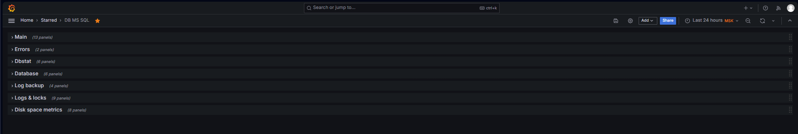
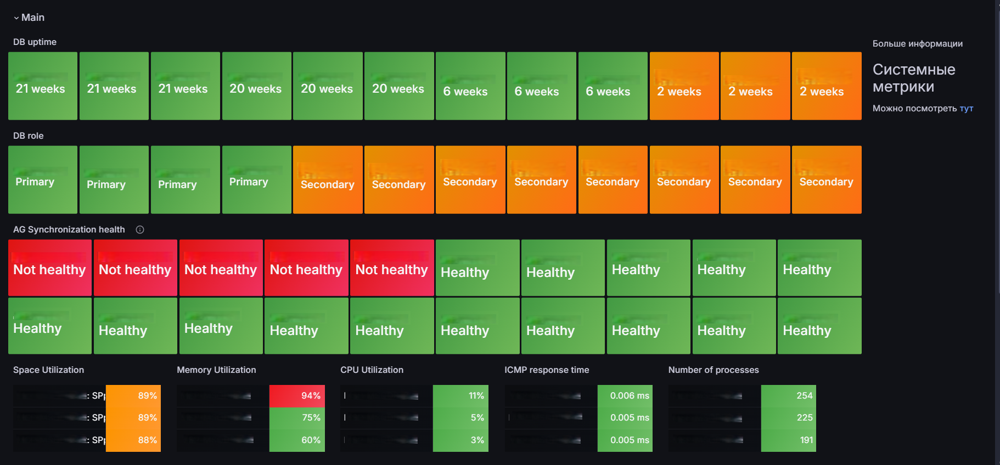
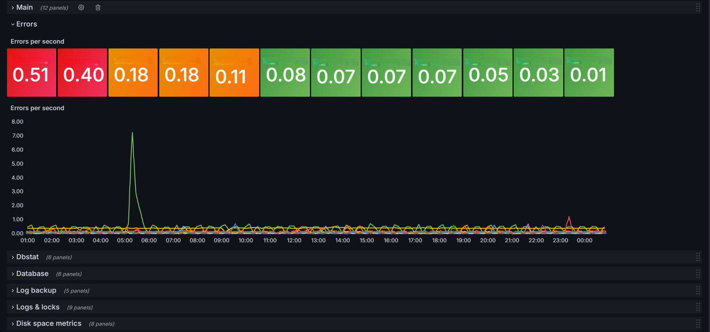
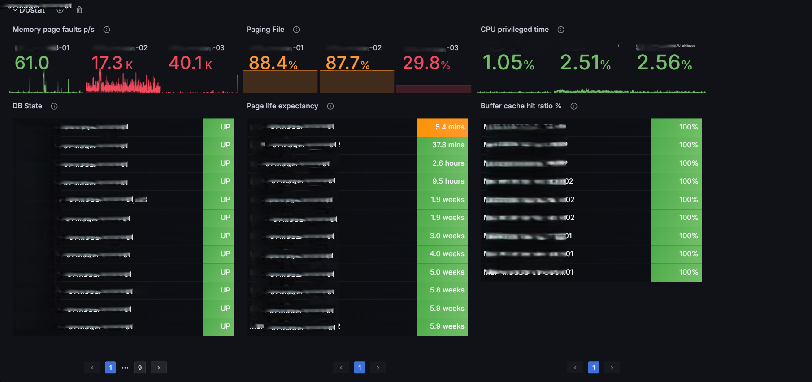
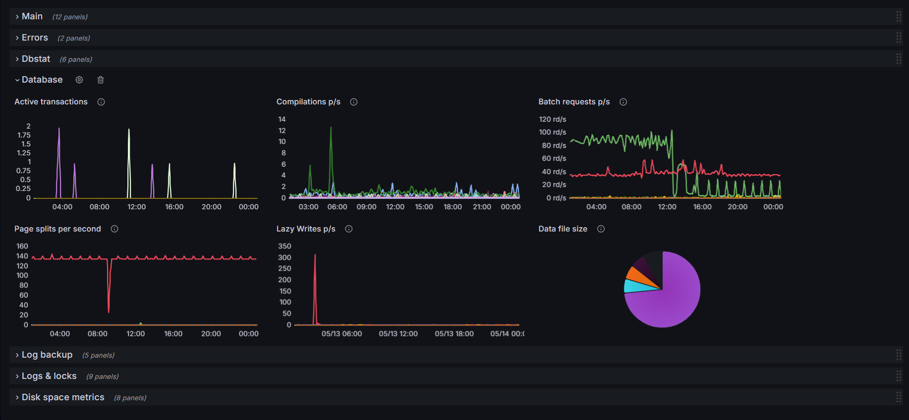
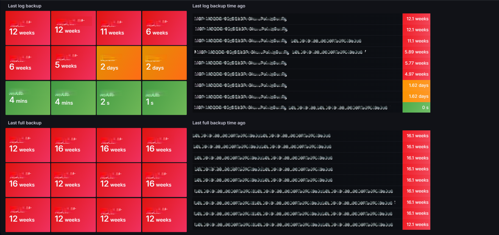
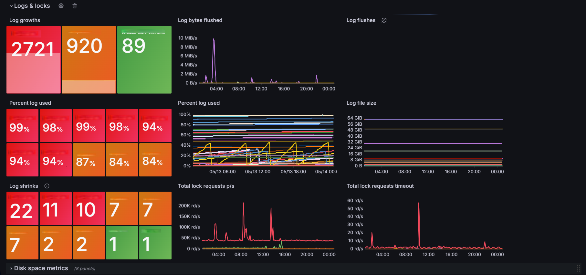
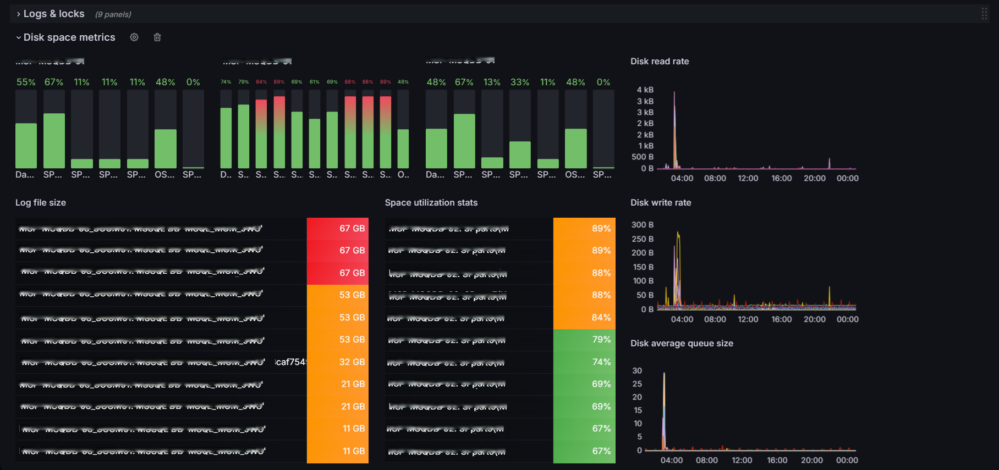

# Grafana Dashboard for MSSQL Monitoring via Zabbix

[](https://grafana.com) [](https://www.zabbix.com) [](https://www.microsoft.com/en-us/sql-server)

This Grafana dashboard provides comprehensive monitoring for MSSQL instances using Zabbix as the data source. It displays key performance metrics, availability status, replication health, and system resource utilization.

<!-- TOC tocDepth:2..3 chapterDepth:2..6 -->
- [Grafana Dashboard for MSSQL Monitoring via Zabbix](#grafana-dashboard-for-mssql-monitoring-via-zabbix)
  - [🖥️ Interface Screenshots](#️-interface-screenshots)
  - [📊 Key Features](#-key-features)
  - [🧩 Dashboard Components](#-dashboard-components)
    - [Main Section](#main-section)
    - [Errors Section](#errors-section)
    - [Dbstat Section](#dbstat-section)
    - [Database Section](#database-section)
    - [Log backup Section](#log-backup-section)
    - [Logs \& locks Section](#logs--locks-section)
    - [Spase metrics Section](#spase-metrics-section)
  - [⚙️ System Requirements](#️-system-requirements)
  - [🚀 Installation](#-installation)
  - [🔧 Zabbix Configuration](#-zabbix-configuration)
  - [⚠️ Implementation Notes](#️-implementation-notes)
    - [Hostname Macros Pattern Configuration](#hostname-macros-pattern-configuration)
    - [Threshold Values](#threshold-values)
  - [📄 License](#-license)
<!-- /TOC -->

## 🖥️ Interface Screenshots










## 📊 Key Features

* Real-time monitoring of MSSQL instances
* Availability Group synchronization status
* Database role visualization (Primary/Secondary)
* Resource utilization metrics (CPU, Memory, Disk, Network)
* Performance counters (page life expectancy, cache hit ratio)
* Backup status monitoring
* Error tracking and alerting

## 🧩 Dashboard Components  

### Main Section  

* **DB uptime**: Shows how long each MSSQL instance has been running
* **DB role**: Indicates whether each instance is Primary or Secondary
* **AG Synchronization health**: Displays health status of Availability Groups

### Errors Section

* **Errors per second**: Tracks database errors over time
* **Error trends**: Visualizes error patterns

### Dbstat Section

* **DB State**: Shows status of individual databases (UP/DOWN)
* **Page life expectancy**: Critical memory performance metric
* **Buffer cache hit ratio**: Measures cache efficiency

### Database Section

* **Active transactions**: Current transaction count
* **Compilations p/s**: SQL compilation rate
* **Batch requests p/s**: Query throughput
* **Page splits p/s**: Index fragmentation indicator
* **Lazy Writes p/s**: Memory pressure indicator
* **Data file size**: Database size distribution

### Log backup Section

* **Last log backup**: Time since last log backup
* **Last full backup**: Time since last full backup

### Logs & locks Section

* **Log growths**: Tracks transaction log growth events
* **Log bytes flushed**: Amount of log data written to disk
* **Percent log used**: Percentage of transaction log space utilized
* **Lock requests**: Shows lock contention metrics


### Spase metrics Section

**Space Utilization**: Disk usage percentages
**Disk read/write rate**: IOPS metrics
**Log file sizes**: Current sizes of transaction log files


## ⚙️ System Requirements

1. **Zabbix Server** 6.0+
2. **Grafana** 11.0+
3. **Zabbix plugin for Grafana** (alexanderzobnin-zabbix-app)

## 🚀 Installation
1. Install Zabbix plugin for Grafana following the [vendor instructions](https://grafana.com/docs/plugins/alexanderzobnin-zabbix-app/latest/installation/)
2. Configure datasource in Grafana:
   ```
   Тип: zabbix1-datasource
   URL: https://your_zabbix_server/api_jsonrpc.php
   ```
1. Import the dashboard:
   ```
   In Grafana: `Create → Import → Upload JSON file`
   Select `MSSQL.json` file
   ```

## 🔧 Zabbix Configuration

Required items from `MSSQL by Zabbix Agent`, `Windows by Zabbix Agent`, `ICMP Ping` templates:
```plaintext
ICMP Ping
* ICMP response time (ms) 

Windows by Zabbix Agent
* Space utilization (%)
* Memory utilization (%)
* CPU utilization (%)
* Number of processes
* Bits received/sent (Bps)
* Disk read/write rate
* Memory page faults per second
* Free swap space in % 

MSSQL by Zabbix Agent
* MSSQL: Uptime
* MSSQL: Role (Primary/Secondary)
* MSSQL: Page life expectancy
* MSSQL: Buffer cache hit ratio
* MSSQL: Active transactions
* MSSQL: Batch requests per second
* MSSQL: Compilations per second
* MSSQL: Page splits per second
* MSSQL: Lazy writes per second
* MSSQL: Errors per second
* MSSQL: Last log backup
* MSSQL: Last full backup
* MSSQL: Data file size
* MSSQL: Lock timeouts
* MSSQL: Data file size
* MSSQL: Disk average queue size
* MSSQL: Log growths
* MSSQL: Log bytes flushed
* MSSQL: Percent log used
* MSSQL: Log file size
* MSSQL: Total lock requests
* MSSQL DB: State
```

## ⚠️ Implementation Notes

* Hosts should be in the `MSSQL VMs` group in Zabbix
* Adjust thresholds according to your environment needs
* The dashboard uses `lastNotNull` reducer for most metrics
* Ensure Zabbix agent is properly configured to collect all required `MSSQL metrics`
* For accurate availability group monitoring, proper permissions must be configured for Zabbix to access MSSQL metrics
* On the `Space metrics tab`, the `Space utilization` shows _specific hosts_, enter your hosts there

### Hostname Macros Pattern Configuration
The dashboard uses regex patterns to extract and format hostnames. Here are the key patterns and how to customize them:

**AG Sync Health Pattern**:
```regex
/^MSP-(MSQDB-\\d+(?:_\\w+)?): MSSQL AG 'MSP-MSQDB-(AG\\d+)' Replica 'MSP-MSQDB-(\\d+)(\\\\\\w+)?': Sync health$/
```
This extracts:
* $1: Hostname (e.g., MSQDB-01_prod)
* $2: AG group (e.g., AG01)
* $3: Replica number (e.g., 02)
* $4: Optional suffix

To customize:
* Replace "MSP-MSQDB" with your hostname prefix
* Adjust the AG and replica patterns if your naming differs

**Database State Pattern**:
```regex
/^([^:]+): MSSQL DB '([^']+)'.*$/
```
This extracts:
* $1: Hostname
* $2: Database name

**General Hostname Cleanup**:
```regex
/^([^:]+):.*$/
```
Extracts just the hostname part before the first colon

To modify these patterns:
* Identify your host naming convention
* Update the regex to match your pattern
* Test with sample item names from your Zabbix
* Adjust the replacement pattern ($1, $2, etc.) to format as desired

For example, if your hosts are named "SQL-PROD-01", change:
```regex
/^MSP-MSQDB-(\\d+):/ → /^SQL-PROD-(\\d+):/
```

### Threshold Values

Metric | Green | Yellow | Red
-------|-------|--------|----
Log Space Used (%) | <70 | 70-90 | >90
Sync Health Status | 2 (Healthy) | 1 (Partial) | 0 (Unhealthy)
Uptime (days) | >30 | 7-30 | <7
Last Log Backup (hours) | <1 | 1-4 | >4
Last Full Backup (days) | <1 | 1-3 | >3
Lock Requests (per sec) | <100 | 100-500 | >500
Lock Timeouts (per sec) | <5 | 5-20 | >20
Buffer Cache Hit Ratio (%) | >98 | 95-98 | <95
Page Life Expectancy (sec) | >1800 | 300-1800 | <300
CPU Utilization (%) | <50 | 50-90 | >90
Memory Utilization (%) | <80 | 80-90 | >90
Disk Read (ops/s) | <50 | 50-100 | >100
Disk Write (ops/s) | <100 | 100-200 | >200
AG Sync Health | 2 (Healthy) | 1 (Partially Healthy) | 0 (Not Healthy)
Disk Space Utilization (%) | <80 | 80-90 | >90
ICMP Response Time (ms) | <100 | 100-500 | >500
Network Traffic (Bps) | <50M | 50M-200M | >200M
Active Transactions | <50 | 50-100 | >100
Batch Requests/sec | <1000 | 1000-5000 | >5000
Page Splits/sec | <50 | 50-80 | >80
Lazy Writes/sec | <5 | 5-10 | >10
Last Backup Age (hours) | <24 | 24-72 | >72


## 📄 License

Project is distributed under [MIT](./LICENSE.txt) license