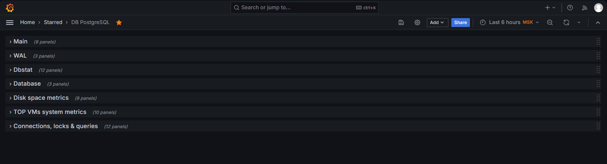
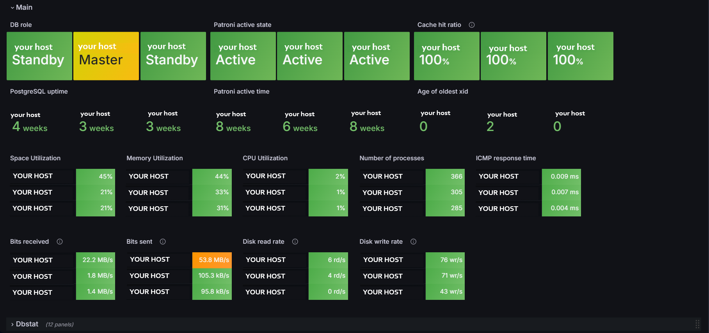
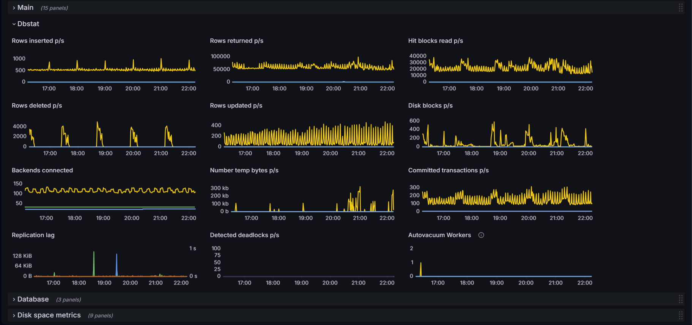
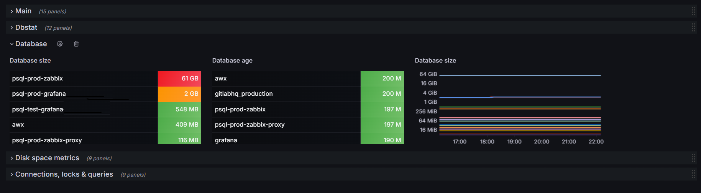
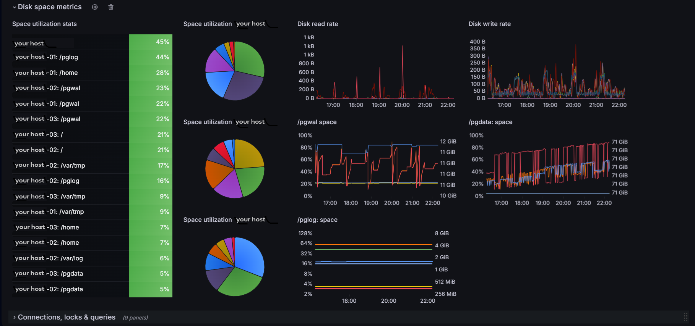
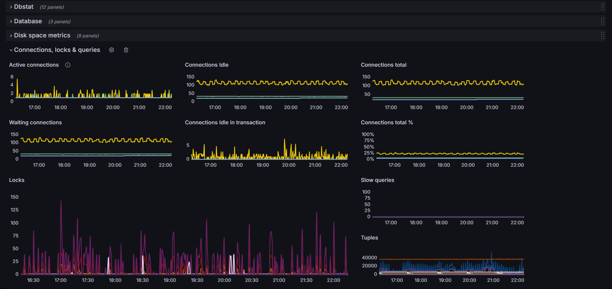

# Grafana Dashboard for PostgreSQL Monitoring via Zabbix

[](https://grafana.com) [](https://www.zabbix.com) [](https://www.postgresql.org/)

This Grafana dashboard provides comprehensive monitoring for PostgreSQL database servers, with a focus on key performance metrics, replication status, and system resource utilization. The dashboard uses Zabbix as its data source and is designed to monitor PostgreSQL instances managed by Patroni.

<!-- TOC tocDepth:2..3 chapterDepth:2..6 -->

- [Grafana Dashboard for PostgreSQL Monitoring via Zabbix](#grafana-dashboard-for-postgresql-monitoring-via-zabbix)
  - [🖥️ Interface Screenshots](#️-interface-screenshots)
  - [📊 Key Features](#-key-features)
  - [🧩 Dashboard Components](#-dashboard-components)
    - [Main Section](#main-section)
    - [WAL Section](#wal-section)
    - [Dbstat Section](#dbstat-section)
    - [Database Section](#database-section)
    - [Disk spase metrics Section](#disk-spase-metrics-section)
    - [Top VMs system metrics Section](#top-vms-system-metrics-section)
    - [Connections, locks \& queries Section](#connections-locks--queries-section)
  - [⚙️ System Requirements](#️-system-requirements)
  - [🚀 Installation](#-installation)
  - [🔧 Zabbix Configuration](#-zabbix-configuration)
  - [⚠️ Implementation Notes](#️-implementation-notes)
    - [Hostname and Database Patterns Configuration](#hostname-and-database-patterns-configuration)
    - [Patterns Configuration Customization Guide](#patterns-configuration-customization-guide)
    - [Threshold Values](#threshold-values)
  - [📄 License](#-license)

<!-- /TOC -->

## 🖥️ Interface Screenshots








## 📊 Key Features

- Real-time monitoring of PostgreSQL server roles (Master/Standby)
- Database performance metrics (queries, transactions, cache)
- Database connection statistics (active, idle, waiting)
- System resource utilization (CPU, memory, disk)
- Custom thresholds and alerting indicators
- Patroni and etcd service monitoring
- Network and ICMP performance
- Replication and WAL metrics

## 🧩 Dashboard Components  

### Main Section  

* **DB Role** - Master/Standby status with color coding
* **Patroni Active State** - Service health indicators
* **Cache Hit Rati** - Buffer cache efficiency
* **PostgreSQL Uptime** - Service longevity
* **Age of Oldest XID** - Transaction age monitoring

### WAL Section

* **Bytes received** - Total bytes received from WAL files
* **Bytes written** - Total bytes written to WAL files
* **Segments count** - Number of WAL segments used

### Dbstat Section

* **Row Operations** - Inserts/updates/deletes per second
* **Block Operations** - Disk/Hit blocks per second
* **Transactions** - Committed transactions rate
* **Replication** - Lag monitoring
* **Deadlocks** - Detection rate
* **Autovacuum**- Worker activity

### Database Section

* **Database size** - Current total size of the database
* **Database age** - Duration since the database was created

### Disk spase metrics Section

* `/pgwal` space utilization
* `/pgdata` space utilization
* `/pglog` space utilization
* Filesystem space usage breakdown

### Top VMs system metrics Section

* **Space Utilization** - Disk space usage (%)
* **Memory Utilization** - Memory usage (%)
* **CPU Utilization** - CPU load (%)
* **Number of processes** - Process count
* **ICMP response time** - Ping response (ms)
* **Bits received/sent** - Network traffic (Bps)
* **Disk read/write rate** - Disk operations rate (ops/s)

### Connections, locks & queries Section

* **Active/Waiting connections** - Number of active and waiting connections
* **Waiting connections** - Count of connections currently waiting
* **Connections idle/total** - Number of idle connections / total connections
* **Tuples inserted/returned/updated/deleted/fetched** - Counts of operations performed on tuples
* **Slow queries** - Number of queries exceeding the defined slow threshold


## ⚙️ System Requirements

1. **Zabbix Server** 6.0+
2. **Grafana** 11.0+
3. **Zabbix plugin for Grafana** (alexanderzobnin-zabbix-app)

## 🚀 Installation
1. Install Zabbix plugin for Grafana following the [vendor instructions](https://grafana.com/docs/plugins/alexanderzobnin-zabbix-app/latest/installation/)
2. Configure datasource in Grafana:
   ```
   Тип: zabbix1-datasource
   URL: https://your_zabbix_server/api_jsonrpc.php
   ```
1. Import the dashboard:
   ```
   In Grafana: `Create → Import → Upload JSON file`
   Select `PostgreSQL.json` file
   ```

## 🔧 Zabbix Configuration

Required items from `PostgreSQL by Zabbix Agent`, `Linux by Zabbix Agent`, `ICMP Ping` and `Systemd by Zabbix Agent` templates:
```plaintext
ICMP Ping
* ICMP response time (ms) 

Linux by Zabbix Agent
* Space utilization (%)      
* Memory utilization (%)     
* CPU utilization (%)        
* Number of processes         
* Bits received/sent (Bps)   
* Disk read/write rate    

PostgreSQL by Zabbix Agent
* PostgreSQL: Replication: Recovery role
* PostgreSQL: Uptime
* PostgreSQL: Age of oldest xid
* PostgreSQL: Cache hit ratio
* PostgreSQL: Tuples inserted/updated/deleted/fetched
* PostgreSQL: Connections (active, idle, waiting, total)
* PostgreSQL: Queries slow
* PostgreSQL: WAL metrics 
* PostgreSQL: Replication: Recovery role
* patroni.service: Active state
* PostgreSQL: Cache hit ratio
* PostgreSQL: Uptime
* PostgreSQL: Age of oldest xid
* Dbstat: Rows inserted/updated/deleted per second
* Dbstat: Backends connected
* Dbstat: Hit blocks read per second
* Dbstat: Disk blocks read per second
* Dbstat: Number temp bytes per second
* WAL: Bytes received/written
* WAL: Segments count

Systemd by Zabbix Agent
* etcd.service: Active state
```

## ⚠️ Implementation Notes

* Hosts should be in the `PostgreSQL VMs` group in Zabbix
* Adjust thresholds according to your environment needs
* The dashboard uses `lastNotNull` reducer for most metrics
* Ensure Zabbix agent is properly configured to collect all required `PostgreSQL metrics`
* For accurate replication monitoring, `Patroni metrics` must be exposed to Zabbix
* On the `Disk space metrics tab`, the `Space utilization Pie Chart` shows _specific hosts_, enter your hosts there

### Hostname and Database Patterns Configuration
The dashboard uses regex patterns to extract and format PostgreSQL-related metrics.  
Here are the key patterns and customization options:

**Database Role Pattern**:
```regex
/^([^:]+):.*$/
```
Extracts: $1: Hostname (e.g., dev-psq-01)

**Database Size Pattern**:
```regex
/.*\[([^\]]+)\]:.*/
```
Extracts: $1: Database name from brackets

**WAL Metrics Pattern**:
```regex
/^([^:]+):.*$/
```
Extracts: $1: Hostname for WAL-related metrics

**Replication Lag Pattern**:
```regex
/(L|l)ag/
```
Matches any metric containing "lag" or "Lag" (case insensitive)

### Patterns Configuration Customization Guide  

**For Hostnames**  
* Current pattern: `^([^:]+)`  
* If your hosts use different format (e.g., region-host-01), update to: `/^(region-[^:]+):/`  

**For Database Names**    
Current extraction from brackets: \[([^\]]+)\]  
For different formatting (e.g., DB=name), use: `/DB=([^\s]+)/`  

**Special Cases**  
Pgbouncer metrics use: `/^([^:]+): HAProxy ([^:]+): Server is active$/`  
Extracting:  
* $1: Hostname  
* $2: Pgbouncer instance name  

**Testing Patterns**   
* Use Zabbix item names as test strings  
* Validate with regex testers like regex101.com  
* Update dashboard transformations after confirmation  

**Example Modifications** 
```  
# For hosts with DC prefix  
/^DC1-([^:]+): PostgreSQL:/  

# For custom database tag format  
/DB\s*:\s*'([^']+)'/  
```

Remember to:
* Escape special characters in your hostnames
* Maintain consistent grouping ($1, $2) in replacements
* Update all related panels when changing naming conventions


### Threshold Values

Metric | Green | Yellow | Red
-------|-------|--------|----
Cache Hit Ratio (%) | >98 | 95-98 | <95
Age of XID (days) | <10 | 10-20 | >20
CPU Utilization (%) | <50 | 50-90 | >90
Memory Utilization (%) | <80 | 80-90 | >90
Disk Read (ops/s) | <50 | 50-100 | >100
Disk Write (ops/s) | <100 | 100-200 | >200
Replication Lag (bytes) | <1MB | 1MB-10MB | >10MB
Backends Connected | <50 | 50-100 | >100
Disk Space Utilization (%) |	<80 |	80-90	| >90
Active Connections (%) |	<70 |	70-90	| >90
ICMP Response Time (ms) |	<100 |	100-500	| >500
Network Traffic (Bps) |	<50M |	50M-200M	| >200M


## 📄 License

Project is distributed under [MIT](./LICENSE.txt) license