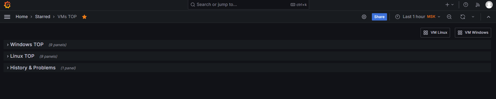

# Grafana VMs TOP Dashboard - Top Metrics for Linux & Windows Virtual Machines

[](https://grafana.com) [](https://www.zabbix.com) [](https://www.linux.com/) [](https://www.microsoft.com/)

Dashboard for monitoring top 4 hosts by critical metrics in virtual machine infrastructure.

<!-- TOC tocDepth:2..3 chapterDepth:2..6 -->
- [Grafana VMs TOP Dashboard - Top Metrics for Linux \& Windows Virtual Machines](#grafana-vms-top-dashboard---top-metrics-for-linux--windows-virtual-machines)
  - [🖥️ Interface Screenshots](#️-interface-screenshots)
  - [📊 Key Features](#-key-features)
  - [🧩 Dashboard Components](#-dashboard-components)
    - [Linux TOP and Windows TOP Sections](#linux-top-and-windows-top-sections)
    - [History \& Problems Section](#history--problems-section)
  - [⚙️ System Requirements](#️-system-requirements)
  - [🚀 Installation](#-installation)
  - [🔧 Zabbix Configuration](#-zabbix-configuration)
  - [⚠️ Implementation Notes](#️-implementation-notes)
    - [Threshold Values](#threshold-values)
  - [📄 License](#-license)
<!-- /TOC -->

## 🖥️ Interface Screenshots




## 📊 Key Features

- **Top 4 hosts** by key metrics
- **Color-coded status** indicators (green/orange/red)
- **Auto-refresh** every minute
- **Integrated links** to detailed dashboards
- **Problem history** on a dedicated tab

## 🧩 Dashboard Components

### Linux TOP and Windows TOP Sections
- **Space Utilization** - Disk space usage (%)
- **Memory Utilization** - Memory usage (%)
- **CPU Utilization** - CPU load (%)
- **Number of processes** - Process count
- **ICMP response time** - Ping response (ms)
- **Bits received/sent** - Network traffic (Bps)
- **Disk read/write rate** - Disk operations rate (ops/s)

### History & Problems Section

* Event and problem history
* Severity filtering (Warning, Average, High)
* Grouping by hosts and time

## ⚙️ System Requirements

1. **Zabbix Server** 6.0+
2. **Grafana** 11.0+
3. **Zabbix plugin for Grafana** (alexanderzobnin-zabbix-app)

## 🚀 Installation
1. Install Zabbix plugin for Grafana following the [vendor instructions](https://grafana.com/docs/plugins/alexanderzobnin-zabbix-app/latest/installation/)
2. Configure datasource in Grafana:
   ```
   Тип: zabbix1-datasource
   URL: https://your_zabbix_server/api_jsonrpc.php
   ```
1. Import the dashboard:
   ```
   In Grafana: `Create → Import → Upload JSON file`
   Select `Top_status_table.json` file
   ```

## 🔧 Zabbix Configuration

Required items from `Windows by Zabbix Agent`, `Linux by Zabbix Agent` and `ICMP Ping` templates:
```plaintext
Space utilization (%)      # For Windows and Linux
Memory utilization (%)     # For Windows and Linux
CPU utilization (%)        # For Windows and Linux
Number of processes        # For Windows and Linux
ICMP response time (ms)    # For all hosts
Bits received/sent (Bps)   # Network traffic
Disk read/write rate       # Disk operations
```

## ⚠️ Implementation Notes

- Dashboard contains links to `VM Linux` и `VMs TOP` dashboards

- For proper functionality, create host groups in Zabbix Web-UI containing hosts to be monitored:
   * For Linux VMs:
      ```plaintext
      AWX VMs, DION VMs, ETCD VMs, FreeIPA VMs, Gitlab VMs
      Gluster FS VMs, Grafana VMs, HAProxy VMs, HCL Linux
      KSMG VMs, Keycloak VMs, MFA VMs, NTP VMs, Netbox VMs
      Nexus VMs, PAM Linux, PDNS VMs, PostgreSQL VMs
      ```
      For simplicity, you can replace it with `Linux Servers`.
   * For Windows VMs - `Windows Servers`.

### Threshold Values

Metric | Green | Orange | Red
-------|-------|--------|----
CPU/Memory/Space (%) | <80 | 80-90 | >90
ICMP (ms) | <200 | 200-300 | >300
Disk ops (ops/s) | <50 | 50-100 | >100
Network (Bps) | <50M | 50M-200M | >200M

## 📄 License

Project is distributed under [MIT](./LICENSE.txt) license