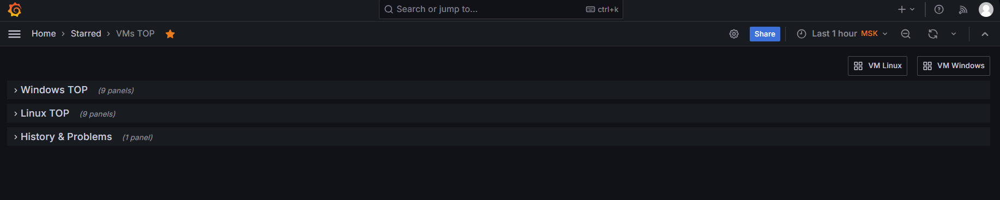
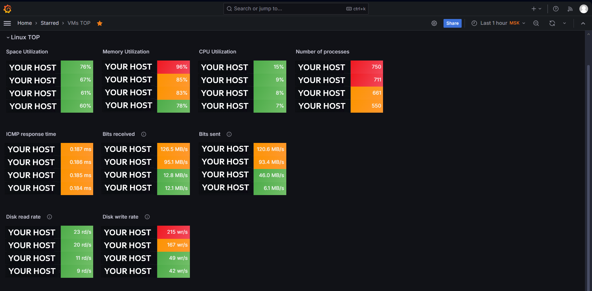
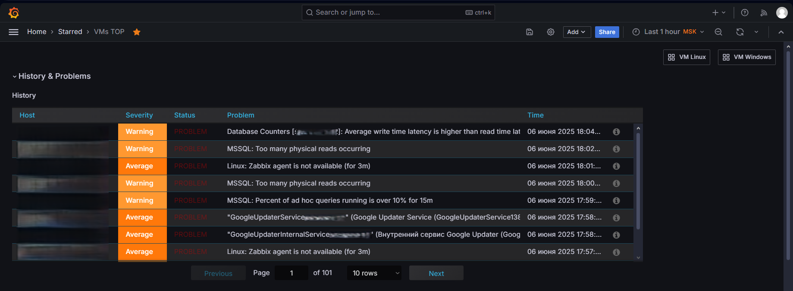
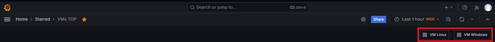

# Дашборд Grafana VMs TOP - Топ метрик виртуальных машин Linux & Windows

[](https://grafana.com) [](https://www.zabbix.com) [](https://www.linux.com/) [](https://www.microsoft.com/)

Дашборд для мониторинга топ-4 хостов по критическим метрикам в инфраструктуре виртуальных машин.

<!-- TOC tocDepth:2..3 chapterDepth:2..6 -->
- [Дашборд Grafana VMs TOP - Топ метрик виртуальных машин Linux \& Windows](#дашборд-grafana-vms-top---топ-метрик-виртуальных-машин-linux--windows)
  - [🖥️ Скриншоты интерфейса](#️-скриншоты-интерфейса)
  - [📊 Основные возможности](#-основные-возможности)
  - [🧩 Компоненты дашборда](#-компоненты-дашборда)
    - [Секции Linux TOP и Windows TOP](#секции-linux-top-и-windows-top)
    - [Секция History \& Problems](#секция-history--problems)
  - [⚙️ Требования к системе](#️-требования-к-системе)
  - [🚀 Установка](#-установка)
  - [🔧 Конфигурация Zabbix](#-конфигурация-zabbix)
  - [⚠️ Особенности реализации](#️-особенности-реализации)
    - [Пороговые значения](#пороговые-значения)
  - [📄 Лицензия](#-лицензия)
<!-- /TOC -->

## 🖥️ Скриншоты интерфейса





## 📊 Основные возможности

- **Топ-4 хостов** по ключевым метрикам
- **Цветовая индикация** статусов (зеленый/оранжевый/красный)
- **Автоматическое обновление** данных (каждую минуту)
- **Интегрированные ссылки** на детальные дашборды
- **История проблем** на отдельной вкладке

## 🧩 Компоненты дашборда

### Секции Linux TOP и Windows TOP
- **Space Utilization** - Использование дискового пространства (%)
- **Memory Utilization** - Использование памяти (%)
- **CPU Utilization** - Нагрузка процессора (%)
- **Number of processes** - Количество процессов
- **ICMP response time** - Время отклика ICMP (мс)
- **Bits received/sent** - Сетевой трафик (Bps)
- **Disk read/write rate** - Скорость дисковых операций (операций/с)

### Секция History & Problems
- История событий и проблем
- Фильтрация по severity (Warning, Average, High)
- Группировка по хостам и времени

## ⚙️ Требования к системе

1. **Zabbix Server** 6.0+
2. **Grafana** 11.0+
3. **Плагин Zabbix для Grafana** (alexanderzobnin-zabbix-app)

## 🚀 Установка

1. Установите плагин Zabbix для Grafana по [инструкции](https://grafana.com/docs/plugins/alexanderzobnin-zabbix-app/latest/installation/) вендора
2. Настройте источник данных в Grafana:
    ```
    Тип: zabbix1-datasource
    URL: https://ваш_zabbix_сервер/api_jsonrpc.php
    ```
1. Импортируйте дашборд:
    ```
    В Grafana: `Create → Import → Upload JSON file`
    Выберите файл `Top_status_table.json`
    ```

## 🔧 Конфигурация Zabbix

Обязательные элементы данных из шаблонов `Windows by Zabbix Agent`, `Linux by Zabbix Agent` и `ICMP Ping`
```plaintext
Space utilization (%)      # Для Windows и Linux
Memory utilization (%)     # Для Windows и Linux
CPU utilization (%)        # Для Windows и Linux
Number of processes        # Для Windows и Linux
ICMP response time (ms)    # Для всех хостов
Bits received/sent (Bps)   # Сетевой трафик
Disk read/write rate       # Дисковые операции
```

## ⚠️ Особенности реализации
- Дашборд содержит ссылки на дашборды `VM Linux` и `VMs TOP`

- Для корректной работы всех панелей в Web-UI Zabbix нужно создать группы хостов в Zabbix, включающие хосты, которые попадут в дашборд.
   * Для Linux машин:
      ```plaintext
      AWX VMs, DION VMs, ETCD VMs, FreeIPA VMs, Gitlab VMs
      Gluster FS VMs, Grafana VMs, HAProxy VMs, HCL Linux
      KSMG VMs, Keycloak VMs, MFA VMs, NTP VMs, Netbox VMs
      Nexus VMs, PAM Linux, PDNS VMs, PostgreSQL VMs
      ```
      Для простоты можно заменить на `Linux Servers`.
   * Для Windows машин - `Windows Servers`.

### Пороговые значения
Метрика | Зеленый | Оранжевый | Красный
--------|---------|-----------|--------
CPU/Memory/Space (%) | <80 | 80-90 | >90
ICMP (мс) | <200 | 200-300 | >300
Disk ops (операций/с) | <50 | 50-100 | >100
Сеть (Bps) | <50M | 50M-200M | >200M

## 📄 Лицензия
Проект распространяется под лицензией [MIT](./LICENSE.txt)